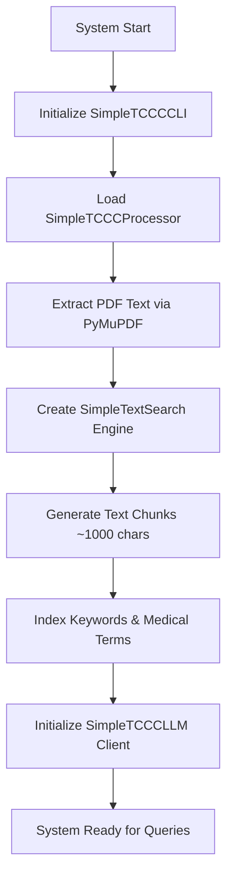
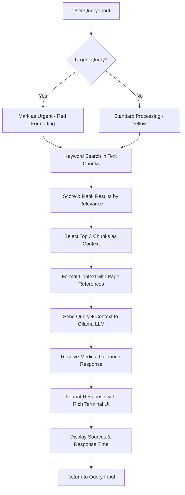
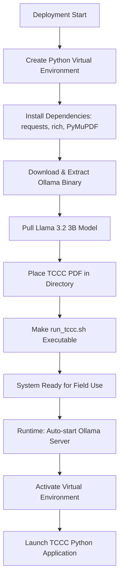

# TCCC Simple - Technical Documentation

## Overview

TCCC Simple is a Retrieval-Augmented Generation (RAG) system designed for emergency medical reference in tactical combat casualty care scenarios. The system provides fast, offline medical guidance using local language models and keyword-based search of TCCC handbook content.

## Architecture Overview

### System Design

```
┌─────────────────────────────────────────────────────────────┐
│                    TCCC Simple Architecture                  │
├─────────────────────────────────────────────────────────────┤
│  CLI Interface (Rich Terminal)                             │
│  ├── Interactive Mode                                       │
│  ├── Single Query Mode                                      │
│  └── Emergency Urgency Handling                             │
├─────────────────────────────────────────────────────────────┤
│  Application Layer                                          │
│  ├── SimpleTCCCCLI (main orchestrator)                     │
│  ├── Query Processing & Response Formatting                │
│  └── Context Management                                     │
├─────────────────────────────────────────────────────────────┤
│  Processing Components                                      │
│  ├── SimpleTCCCProcessor (PDF text extraction)             │
│  ├── SimpleTextSearch (keyword matching)                   │
│  └── SimpleTCCCLLM (Ollama API client)                     │
├─────────────────────────────────────────────────────────────┤
│  External Services                                          │
│  ├── Ollama Server (Local LLM - Llama 3.2 3B)             │
│  ├── PyMuPDF (PDF processing)                              │
│  └── TCCC Handbook PDF                                     │
└─────────────────────────────────────────────────────────────┘
```

## Backend Workflow

### 1. System Initialization



**Key Steps:**
1. **PDF Processing**: Extract text from TCCC handbook using PyMuPDF
2. **Text Chunking**: Split content into ~1000 character chunks with overlap
3. **Search Index**: Create keyword-based search index with medical term boosting
4. **LLM Connection**: Establish connection to local Ollama server

### 2. Query Processing Workflow



**Detailed Process:**

1. **Input Processing**
   - Parse user query for urgency markers (`urgent:`, `emergency:`, `critical:`)
   - Clean and normalize query text
   
2. **Context Retrieval**
   - Perform keyword search across text chunks
   - Apply medical term boosting (hemorrhage, airway, etc.)
   - Score chunks by keyword frequency and medical relevance
   - Select top 3 chunks as context (max 600 chars each)

3. **LLM Query**
   - Format system prompt for TCCC medical assistance
   - Combine user query with retrieved context
   - Send to Ollama API with specific parameters:
     - Temperature: 0.2 (for consistent medical guidance)
     - Max tokens: 400 (concise field responses)
     - Model: llama3.2:3b

4. **Response Formatting**
   - Apply urgency-based color coding (red/green panels)
   - Display source references with page numbers
   - Show response time for performance monitoring

### 3. Deployment Workflow



## Component Architecture

### Core Classes

#### 1. SimpleTCCCProcessor
**Purpose**: PDF text extraction and preprocessing
**Technologies**: PyMuPDF (fitz)

```python
Key Methods:
- extract_text_simple(): Extract text from TCCC PDF
- Error handling for missing dependencies
- Page-aware text extraction with markers
```

#### 2. SimpleTextSearch
**Purpose**: Keyword-based search and ranking
**Technologies**: Native Python text processing

```python
Key Features:
- Text chunking with overlap
- Keyword frequency scoring
- Medical term boosting
- Page reference tracking
```

#### 3. SimpleTCCCLLM
**Purpose**: Local language model interaction
**Technologies**: Ollama API, requests library

```python
Configuration:
- Host: http://127.0.0.1:11434
- Model: llama3.2:3b
- Temperature: 0.2
- Max tokens: 400
```

#### 4. SimpleTCCCCLI
**Purpose**: User interface and orchestration
**Technologies**: Rich terminal library, argparse

```python
Key Features:
- Interactive and single-query modes
- Urgency detection and formatting
- Response time monitoring
- Source attribution
```

## Data Flow

### Text Processing Pipeline

```
TCCC PDF (100 pages)
    ↓ PyMuPDF
Raw Text (~300KB)
    ↓ Text Chunking
119 Text Chunks (~1KB each)
    ↓ Keyword Indexing
Search-Ready Knowledge Base
    ↓ Query Matching
Top 3 Relevant Chunks
    ↓ Context Formation
LLM Input Context (~1.8KB)
```

### Query Response Pipeline

```
User Query
    ↓ Keyword Extraction
Search Terms + Medical Boosting
    ↓ Chunk Scoring
Ranked Results (score-based)
    ↓ Context Selection
Top 3 chunks + page references
    ↓ LLM Processing
Medical guidance response
    ↓ UI Formatting
Rich terminal output with sources
```

## Performance Characteristics

### System Requirements
- **CPU**: Multi-core recommended for Ollama
- **GPU**: 12GB+ VRAM for optimal LLM performance
- **RAM**: 32GB recommended (8GB GPU + 4GB system minimum)
- **Storage**: ~5GB for models and dependencies
- **Network**: None required after setup (offline operation)

### Performance Metrics
- **Response Time**: 4-6 seconds average
- **Text Processing**: 96 PDF pages → 119 searchable chunks
- **Model Size**: Llama 3.2 3B (~2GB)
- **Memory Usage**: ~8GB GPU + 4GB RAM during operation
- **Startup Time**: ~30 seconds (Ollama initialization)

## Security & Deployment

### HPC Environment Compatibility
- **No Sudo Required**: All components in user space
- **Local Processing**: No data transmission to external services
- **Portable Installation**: Self-contained directory structure
- **Virtual Environment**: Isolated Python dependencies

### Field Deployment Considerations
- **Offline Operation**: No internet required after setup
- **Resource Monitoring**: GPU memory and CPU usage tracking
- **Error Recovery**: Graceful handling of connection/model failures
- **Quick Startup**: Launcher script for automated initialization

## Extension Points

### Potential Frontend Development

While the current system is CLI-based, future frontend development could include:

1. **Web Interface**
   - FastAPI backend serving the existing TCCC logic
   - React/Vue.js frontend for browser-based queries
   - WebSocket connections for real-time responses

2. **Mobile Application**
   - React Native or Flutter wrapper
   - Offline-capable mobile deployment
   - Touch-optimized emergency interface

3. **API Service**
   - RESTful API endpoints
   - Authentication for multi-user scenarios
   - Logging and audit trails

### Backend Extensions

1. **Enhanced Search**
   - Vector embeddings for semantic search
   - Multi-modal support (images, diagrams)
   - Fuzzy matching for medical terminology

2. **Model Improvements**
   - Fine-tuned medical models
   - Multi-model ensemble responses
   - Confidence scoring and uncertainty handling

3. **Data Management**
   - Version control for handbook updates
   - User query logging and analytics
   - Performance optimization caching

## Development Workflow

### Local Development Setup

```bash
# 1. Environment Setup
python3 -m venv tccc_env
source tccc_env/bin/activate
pip install requests rich PyMuPDF

# 2. Ollama Installation
# Download and extract Ollama for your platform
# Pull required model: llama3.2:3b

# 3. TCCC Handbook
# Place PDF: 5-100pg-tactical-casualty-combat-care-handbook.pdf

# 4. Launch Development
./run_tccc.sh
```

### Testing Workflow

```bash
# Unit Testing (manual verification)
./run_tccc.sh "test query"

# Performance Testing
./run_tccc.sh "massive hemorrhage" --urgent

# Integration Testing
# Test all query types and edge cases

# Field Testing
# Verify offline operation and response times
```

### Maintenance Workflow

1. **Model Updates**: Update Ollama models as needed
2. **Handbook Updates**: Replace PDF and reinitialize
3. **Dependency Management**: Regular pip updates
4. **Performance Monitoring**: Response time and accuracy tracking
5. **Error Logging**: Monitor ollama.log for issues

## Conclusion

TCCC Simple represents a focused, efficient implementation of RAG for emergency medical reference. The architecture prioritizes:

- **Speed**: Sub-6-second responses for field use
- **Reliability**: Offline operation with minimal dependencies  
- **Simplicity**: Straightforward keyword search over complex embeddings
- **Portability**: HPC-compatible deployment without root access

The system successfully balances technical sophistication with practical field requirements, making it suitable for real-world tactical medical scenarios where every second matters.